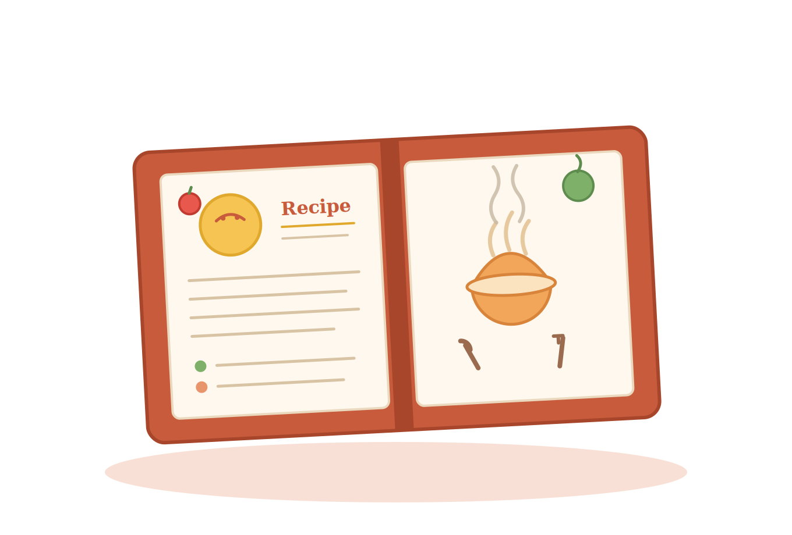

<div align="center">




</div>

# 🍳 My Recipes App

A mini recipe app built with **Next.js**, designed while working through coding labs.

🔗 **Live demo:** [jdbostonbu-ops.github.io/my-recipes-app](https://jdbostonbu-ops.github.io/my-recipes-app/)

---

## 🛠️ Built With

| Layer        | Technology                          |
| ------------ | ----------------------------------- |
| Framework    | Next.js (App Router)                |
| Language     | JavaScript                          |
| Styling      | CSS                                 |
| Fonts        | Geist (via `next/font`)             |
| Tooling      | ESLint                              |
| Deployment   | GitHub Pages                        |

---

## 📖 About

My Recipes App is a small project for browsing and viewing recipes, built while learning modern web development. It uses the Next.js App Router with file-based routing, organized into `app/` for pages and routes, `lib/` for shared logic and data, and `public/` for static assets.

---

## ✨ Features

- 📋 Browse a collection of recipes
- 🔍 View individual recipe details
- ⚡ Fast page loads with Next.js
- 📱 Responsive layout

> _Adjust this list to match exactly what your app does._

---

## 🚀 Getting Started

First, install dependencies:

```bash
npm install
```

Then run the development server:

```bash
npm run dev
```

Open [http://localhost:3000](http://localhost:3000) in your browser to see the result.

You can start editing the app by modifying files in the `app/` directory. The page auto-updates as you edit.

---


## 🌐 Deployment

This project deploys to **GitHub Pages** at
[jdbostonbu-ops.github.io/my-recipes-app](https://jdbostonbu-ops.github.io/my-recipes-app/).

It can also be deployed on [Vercel](https://vercel.com/new), the platform from the creators of Next.js.

---

## 👩‍💻 Author

Built by **Jacqueline Delgado** while working through coding labs.

🔗 [jacquelinedelgado.com](https://jacquelinedelgado.com/)
